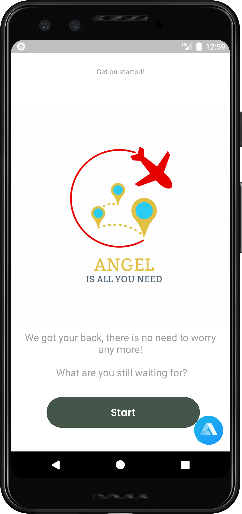

# Angel Tour Guide for Disabilities in Malaysia

## Overview

Welcome to the Angel Tour Guide app, a compassionate and accessible platform designed to empower individuals with disabilities to explore and enjoy Malaysia. This Flutter-based application aims to provide a seamless and inclusive travel experience, offering essential information and assistance for users with varying accessibility needs.

## Features

### 1. Accessible Attractions

- **Explore Accessible Places:** Discover tourist attractions, restaurants, and public spaces that are disability-friendly.
- **Accessibility Ratings:** Access detailed information about the accessibility features of each location, including ramps, elevators, and restroom facilities.

### 2. Customized Itineraries

- **Tailored Tours:** Create personalized itineraries based on your accessibility requirements and preferences.
- **Real-time Navigation:** Navigate through tourist spots with step-by-step directions and information about accessible transportation options.

### 3. Emergency Assistance

- **SOS Button:** Quickly access emergency services and support in case of unforeseen situations.
- **Locate Nearby Help:** Find the nearest accessible facilities, hospitals, and assistance points.

### 4. Community Support

- **Connect with Others:** Join a supportive community of travelers with disabilities to share experiences and recommendations.
- **Accessibility Reviews:** Contribute by providing accessibility reviews for different locations and attractions.

### 5. Language and Communication

- **Multilingual Support:** Access information in multiple languages to cater to a diverse user base.
- **Communication Aid:** Utilize in-app features to assist with communication for users with speech or hearing impairments.

## Getting Started

To experience the Angel Tour Guide app:

1. **Clone the Repository:**
   ```bash
   git clone https://github.com/Syf-Almjd/Angel_Tour_Guide.git
   ```

2. **Navigate to the Project Directory:**
   ```bash
   cd Angel_Tour_Guide
   ```

3. **Install Dependencies:**
   ```bash
   flutter pub get
   ```

4. **Run the App:**
   ```bash
   flutter run
   ```

## Screenshots


| Screenshot 1                              | Screenshot 2                              | Screenshot 3                              |
|-------------------------------------------|-------------------------------------------|-------------------------------------------|
|  |  |  |

| Screenshot 4                              | Screenshot 5                              | Screenshot 6                              |
|-------------------------------------------|-------------------------------------------|-------------------------------------------|
|  |  |  |

| Screenshot 7                              | Screenshot 8                              |
|-------------------------------------------|-------------------------------------------|
|  |  |


One of the unique features of Angel Tour Guide is its accessibility feature, which includes features such as text-to-speech and voice navigation, providing a smooth and easy experience for users who are visually impaired. Furthermore, the app provides detailed information about accessibility accommodations, such as wheelchair ramps and accessible washrooms, allowing users to plan their visits accordingly.


## Requirements

- Flutter 2.0.0 or later
- Dart 2.12.0 or later
- GPS and internet connection for location-based features

## Contributing

Your contributions are valuable! If you have suggestions, feature requests, or encounter issues, please open an issue or submit a pull request.

## License

This project is licensed under the [MIT License](https://opensource.org/license/mit/).

## Contact

For support or inquiries, please contact me at syfalmjd11@gmail.com.

Thank you for choosing Angel Tour Guide. We hope it enhances your travel experiences in Malaysia!

